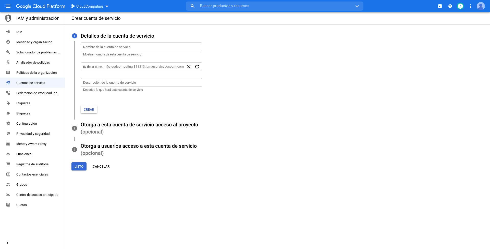
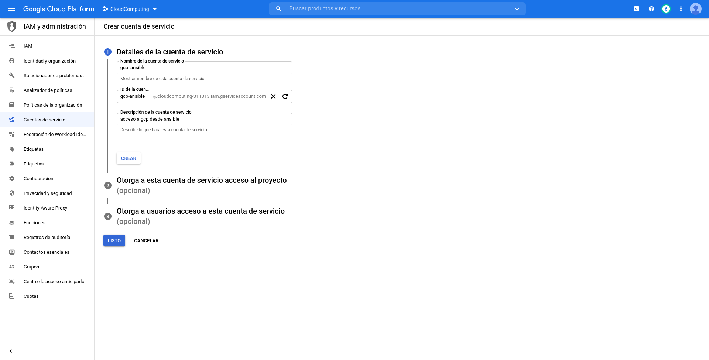
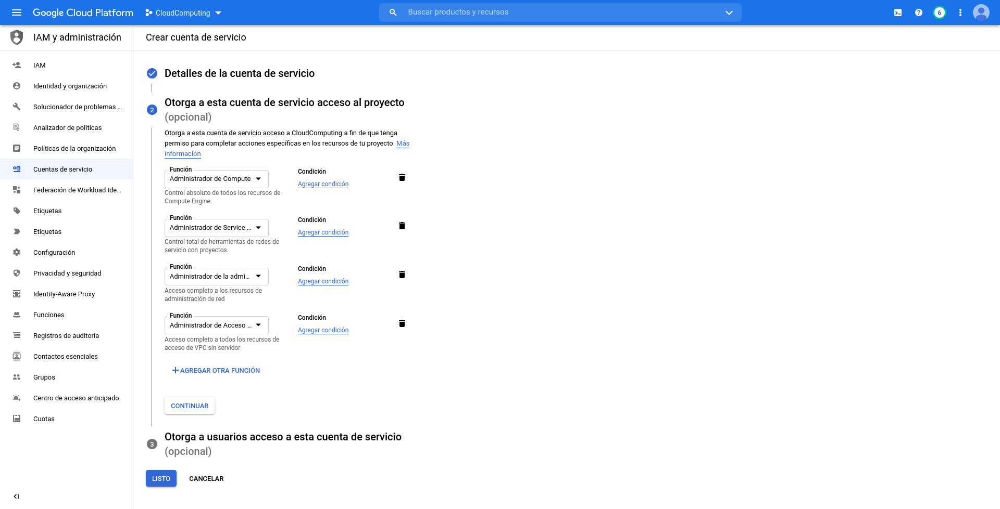
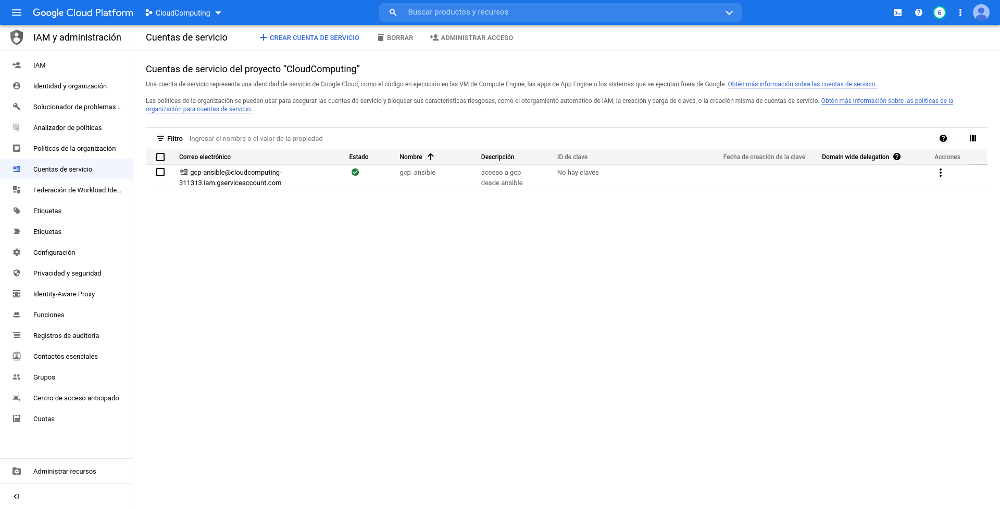
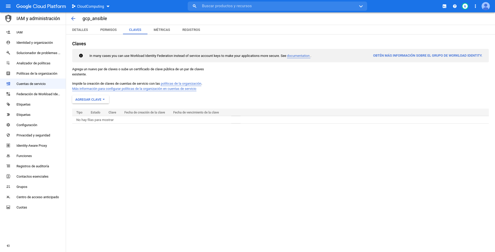
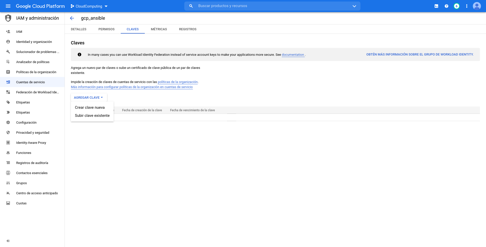
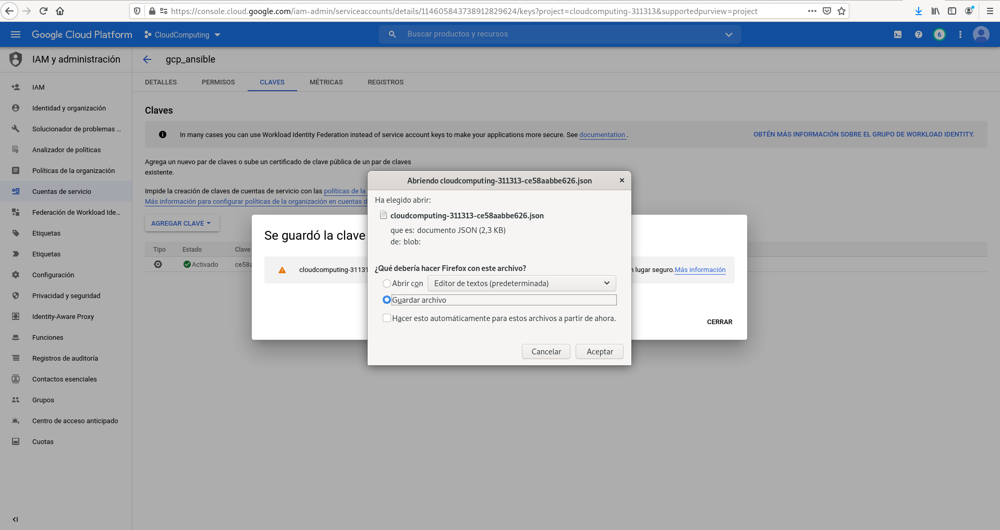
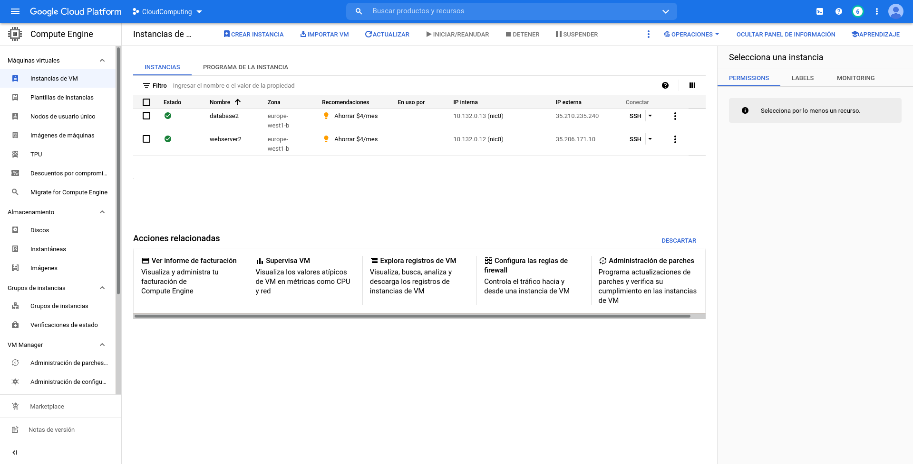

# Tarea: Infraestructura como Código: Ansible
## Cloud Computing

## Enunciado

- Instala Ansible en una máquina de tu elección
- Crea dos máquinas virtuales (webserver, database)  en AWS o GCP. Opcionalmente, utiliza un Playbook para crear las máquinas con Ansible
- Crea un inventario con esas máquinas
- Crea un Playbook para hacer ping a ambas máquinas
- Crea un Playbook para instalar Apache y PHP, en webserver, y MySQL en database
- Opcionalmente, crea los Playbooks necesarios para copiar una pequeña App en el webserver que conecte con la base de datos.
- Sube los ficheros creados a un repositorio Github y publica en enlace a ese repositorio en esta tarea

## Instalación de Ansible en Debian

En primer lugar, instalamos Ansible en la máquina anfitrión. En nuestro caso, esta está basada en Debian 11.

Para instalar Ansible en Debian utilizamos el gestor de paquetes `apt`

	sudo apt install ansible

Esto instalará los paquetes necesarios para Ansible. 

## Creación de las máquinas virtuales

Una vez instalado Ansible, pasamos a crear las dos máquinas virtuales. En nuestro caso, las crearemos sobre GCP. Para crearlas, escribimos un playbook utilizando los módulos de la API `google.cloud` de Ansible. El playbook se almacena en el fichero [`create_instances_playbook.yaml](https://github.com/AlmuHS/Practica_Ansible_Cloud/blob/master/create_instances_playbook.yaml).

Como host se indica `localhost`, para indicar que el playbook se ejecuta sobre la máquina anfitrión. El playbook creará la red, las direcciones de cada VM y las instancias de las VM. Además, ajustará las reglas de firewall necesarias para poder dar acceso a ssh y a apache, y permitir que el webserver acceda a la base de datos de "database".

Para comprobar que ha ido todo bien, el playbook esperará a que el puerto ssh esté abierto en ambas máquinas.

### Asignación de las variables

Este playbook requiere de la configuración de varias variables:

Las dos primeras variables servirán para acceder a GCP con los permisos necesarios para crear las VM

- `gcp_cred_file`: Fichero donde se almacena la clave de nuestra cuenta de servicio de GCP
- `gcp_project`: Nombre del proyecto de GCP donde se alojarán nuestras VM

Las otras dos variables servirán para asociar una clave ssh a las VM, vinculada a nuestra máquina anfitrión y usuario. Esto permitirá acceder a las máquinas en los playbook posteriores, para añadir los paquetes y configuraciones necesarias dentro de los mismos

- `ssh_key`: Clave ssh pública asociada a nuestra máquina anfitrión y usuario
- . `user`: nombre de nuestro usuario

#### Creación de la cuenta de servicio

Para crear la cuenta de servicio debemos entrar, dentro de nuestro proyecto de GCP, en la sección "IAM y Administración" y, en el panel lateral, seleccionar "Crear cuenta de servicio". 

Rellenamos los datos y pulsamos en "Crear"

Posteriormente, deberemos asignar los roles necesarios a la cuenta, para tener los permisos necesarios para crear y gestionar los recursos y las instancias.

.png)

Dentro de la lista, buscamos los roles correspondientes a la administración de los recursos de Compute Engine, administración de la administración de la red, y administración de acceso a VPC sin servidor.

Una vez terminado, pulsamos en "Listo" para crear la cuenta de servicio.

##### Descarga de la clave

Una vez creada la cuenta de servicio con los permisos necesarios, descargamos la clave a nuestro equipo.
Pulsamos en el nombre de nuestra cuenta de servicio, y entramos en la pestaña "Claves"

Pulsamos en "Agregar clave" -> "Crear clave nueva"

En formato, seleccionamos JSON

.png)

Pulsamos en "Crear"

Se nos descargará el fichero de la clave de nuestro equipo.

##### Modificación de la clave en el playbook

Una vez descargado, modificamos la ruta de la variable `gcp_cred_file` por la ruta del fichero recién descargado.

#### Creación de la clave ssh

La clave de servicio nos servirá para crear las instancias de las VM. Pero, para poder administrarlas, necesitaremos sincronizar nuestras claves ssh en dichas instancias. 

Para crear la clave ssh, en Linux escribimos:

	ssh-keygen -t rsa

	Generating public/private rsa key pair.
	Enter file in which to save the key (/home/almu/.ssh/id_rsa): id_rsa
	Enter passphrase (empty for no passphrase): 
	Enter same passphrase again: 
	Your identification has been saved in id_rsa
	Your public key has been saved in id_rsa.pub
	The key fingerprint is:
	SHA256:mSGfSlPZdSv16im47zn0/015SXmRgzoJGt8LAysPLPw almu@debian
	The key's randomart image is:
	+---[RSA 3072]----+
	|            . o  |
	|         o . o.o.|
	|      .o+.. ...+.|
	|  . .  +*=o o. .+|
	|   o +ooS+ =  .o.|
	|    o.+o  o.+...+|
	|     E..  .o..ooo|
	|           ..o..o|
	|          .o+. .=|
	+----[SHA256]-----+

Esto nos creará dos ficheros: `id_rsa`, correspondiente a la clave privada; e `id_rsa.pub`, correspondiente a la clave pública.

Abrimos el fichero `id_rsa.pub`, y copiamos su contenido en la variable `ssh_key` del playbook, reemplazando el contenido anterior.

En la variable `user` introducimos nuestro nombre de usuario (si no lo sabemos, debe aparecer dentro del fichero `id_rsa.pub`, al final de la clave, antes del @)

Con esto, la clave ssh se asociará automáticamente al crear las instancias de las VM.

### Ejecución del playbook

Para ejecutar el playbook, utilizamos el comando `ansible-playbook`.

	ansible-playbook  create_instances_playbook.yaml

Dado que aún no hemos creado las máquinas, no requerimos inventario para su ejecución

Si todo ha ido bien, veremos una salida similar a esta:

	[WARNING]: No inventory was parsed, only implicit localhost is available
	[WARNING]: provided hosts list is empty, only localhost is available. Note that
	the implicit localhost does not match 'all'
	
	PLAY [Create GCP instances] ****************************************************
	
	TASK [create a network] ********************************************************
	ok: [localhost]
	
	TASK [create the webserver address] ********************************************
	ok: [localhost]
	
	TASK [create the database address] *********************************************
	ok: [localhost]
	
	TASK [create the instances] ****************************************************
	ok: [localhost]
	ok: [localhost]
	
	TASK [create a external firewall] **********************************************
	ok: [localhost]
	
	TASK [create a internal firewall] **********************************************
	ok: [localhost]
	
	TASK [Wait for webserver SSH to come up] ***************************************
	ok: [localhost]
	
	TASK [Wait for database SSH to come up] ****************************************
	ok: [localhost]
	
	PLAY RECAP *********************************************************************
	localhost                  : ok=8    changed=1    unreachable=0    failed=0    skipped=0    rescued=0    ignored=0  

### Creación del inventario

Una vez creadas las máquinas, creamos un inventario con las mismas. En el inventario añadimos un nombre para cada máquina, e indicamos la dirección IP de la misma. 

Para obtener las direcciones IP, nos vamos a la web de Google Cloud y, en Compute Engine, buscamos nuestras máquinas. En este caso, se llamarán "webserver2" y "database2".

Nos anotamos las direcciones IP externas de nuestras máquinas, que las añadiremos posteriormente al inventario. También necesitaremos la IP interna de "webserver2", que la necesitaremos posteriormente.

#### Añadiendo máquinas al inventario

Para añadir las máquinas al inventario, debemos editar el fichero correspondiente al mismo.
En nuestro caso, usaremos el fichero `~/.ansible/hosts`  como inventario. 

Este fichero tendrá el siguiente contenido:

	[local]
	control ansible_connection=local

En nuestro caso, crearemos un nuevo grupo de instancias, llamado `gcp_instances` y añadiremos dos máquinas: webserver y database

Para crear un nuevo grupo, en una nueva línea, introducimos `[nombre_grupo]` reemplazando *nombre_grupo* por el nombre del grupo a crear.

Posteriormente, añadimos debajo del nombre del grupo, una línea por cada máquina a añadir, indicando el nombre de la máquina y su IP. También añadiremos la ubicación de la clave ssh privada a utilizar para acceder a las máquinas.

El inventario quedará de forma parecida a esta:

	[gcp_instances]
	webserver ansible_host=35.206.171.10 ansible_ssh_private_key_file=./id_rsa 
	database ansible_host=35.210.235.240 ansible_ssh_private_key_file=./id_rsa 
	[local]
	control ansible_connection=local

Donde `ansible_host` almacenará la IP externa de la máquina en cuestión. 

##### Creando variables

Para almacenar la IP interna del webserver, nos crearemos una nueva variable, a la que llamaremos `webserver_internal_address`. 

Para crear variables en un grupo, añadimos al final del fichero una sección con `[nombre_grupo:vars]`, debajo de la cual declararemos las variables con `nombre_variable=valor`. En nuestro caso, esto quedará así:  
  
	[gcp_instances:vars]
	webserver_internal_address=10.132.0.12

### Lanzando un ping a las máquinas

Para probar el acceso a las máquinas, lanzaremos un ping a estas. Para ello, utilizaremos el módulo "ping" de Ansible, el cual lanzaremos a las máquinas indicadas en nuestro inventario a través de un playbook. En en playbook, en la variable `hosts` indicamos los nombres de nuestras máquinas que hemos especificado en el inventario.

El módulo ping no solo comprobará el acceso a la máquina, sino también la existencia de una infraestructura adecuada para Ansible, concretamente, la existencia de un intérprete de Python. Para ello, requerirá de acceso ssh, el cual se realizará con el par de claves generado anteriormente.

El playbook se almacena en el fichero [`ping_playbook.yml`](https://github.com/AlmuHS/Practica_Ansible_Cloud/blob/master/ping_playbook.yml), y lo ejecutamos con el comando

	ansible-playbook -i ~/.ansible/hosts ping_playbook.yml 

Si todo va bien, veremos algo como esto:

	PLAY [Send ping to instances] *******************************************************************************************************************************************************************************************
	
	TASK [send ping] ********************************************************************************************************************************************************************************************************
	The authenticity of host '35.210.235.240 (35.210.235.240)' can't be established.
	ECDSA key fingerprint is SHA256:Fz69RVCsAz37ftS70Kh19wIA1VTxCPH9DUuR5ts2gZs.
	Are you sure you want to continue connecting (yes/no/[fingerprint])? yes
	ok: [database]
	
	PLAY RECAP **************************************************************************************************************************************************************************************************************
	database                   : ok=1    changed=0    unreachable=0    failed=0    skipped=0    rescued=0    ignored=0   
	
Dado que es el primer acceso, nos pedirá confirmación para registrar su clave ssh. Escribimos "yes" y pulsamos Enter. Es posible que tengamos que modificar el playbook para realizar el acceso a un único host (primero webserver y luego database).

Una vez resuelto el problema, podemos volver a añadir ambos hosts, y ejecutar el playbook completo.
Esta vez ya debería ejecutarse en ambos hosts sin problemas  
  
	PLAY [Send ping to instances] *******************************************************************************************************************************************************************************************
	
	TASK [send ping] ********************************************************************************************************************************************************************************************************
	ok: [webserver]
	ok: [database]
	
	PLAY RECAP **************************************************************************************************************************************************************************************************************
	database                   : ok=1    changed=0    unreachable=0    failed=0    skipped=0    rescued=0    ignored=0   
	webserver                  : ok=1    changed=0    unreachable=0    failed=0    skipped=0    rescued=0    ignored=0   
	
### Instalando paquetes

Comprobado que tenemos acceso ssh a las máquinas y estas responden correctamente, instalamos los paquetes necesarios en cada una.

- En "database", instalamos los paquetes `mysql-client`, `mysql-server` y `python3-pip` (necesario para instalar el conector de MySQL para Ansible). A través de pip, también instalamos `PyMySQL`.

- En "webserver", instalamos los paquetes los paquetes `apache2`, `php`, `php-mysql` y `php-db` (este último contiene el módulo "mysqli", necesario para conectar a MySQL desde la aplicación).

Para realizar la instalación, nos creamos un playbook. Este actualizará la caché de apt en ambas máquinas, instalará los paquetes correspondientes, y activará los servicios necesarios en cada una (apache en "webserver", mysql en "database").

El playbook se almacena en el fichero [`install_packages_playbook.yml`](https://github.com/AlmuHS/Practica_Ansible_Cloud/blob/master/install_packages_playbook.yml) y lo podemos ejecutar con el comando:

	ansible-playbook -i ~/.ansible/hosts install_packages_playbook.yml

### Creando la base de datos en MySQL

Una vez con mysql instalado en "database", creamos una base de datos y un usuario para acceder a la misma desde "webserver".Para rellenar la base de datos, creamos un script en SQL, el cual creará las tablas e insertará los datos en las mismas. 

El acceso a MySQL se realiza mediante el módulo "mysql_db". Este módulo requiere del directorio `mariadb.conf.d`. Dado que en nuestra máquina ese directorio se llama `mysql.conf.d`, debemos establecer un enlace simbólico con el nombre requerido por el módulo.

Tras esto, copiamos el fichero SQL a "database", y lo cargamos en la base de datos indicando el estado "dump" en la tarea correspondiente. Para acceder sin requerir usuario, la tarea se realizará con la opción `become` activada, y realizando el acceso mediante un socket mysqld.

Finalmente, creamos un usuario que tenga acceso a esa base de datos, con permisos para poder realizar consultas. Este usuario estará asociado a "webserver", para lo cual utilizaremos la IP interna almacenada anteriormente en el inventario.

Esto se implementará en el playbook [`create_db_playbook.yml`](https://github.com/AlmuHS/Practica_Ansible_Cloud/blob/master/create_db_playbook.yml), el cual ejecutamos con el comando:

	ansible-playbook -i ~/.ansible/hosts create_db_playbook.yml

Esto creará una base de datos llamada "test_db", con 3 tablas: USUARIOS, ALUMNOS y PROFESORES. En esta se almacenarán los datos del personal de un colegio: en USUARIOS se almacenan los datos personales de todos los usuarios y, en las tablas de ALUMNOS y PROFESORES, según el tipo de personal al que corresponda el usuario, se almacenará cierta información sobre los mismos.

A su vez, creará un usuario "test_user" con contraseña "test", asociado a la IP interna de "webserver".

### Desarrollando la aplicación web

Para probar el acceso, creamos un pequeño script PHP que se conecte a la base de datos y realice varias consultas en función de los datos de la interfaz.

La interfaz se compondrá de un selector, en el cual se elegirá el tipo de usuario a consultar: profesor o alumno; un cuadro de texto, donde se escribirá el nombre de pila del usuario a buscar; y un botón para enviar la consulta.

Si el cuadro de texto se queda vacío, la página mostrará los nombres de todos los alumnos o profesores, en función de la opción que se haya seleccionado. Si el cuadro de texto contiene algún nombre, la página buscará los datos de dicho usuario en la base de datos del tipo seleccionado (profesor o alumno), y mostrará sus datos.

La aplicación se almacena en el fichero [`connectmysql.php`](https://github.com/AlmuHS/Practica_Ansible_Cloud/blob/master/connectmysql.php). Antes de ejecutarla debemos editar la variable `$dbhost` con la IP interna de la base de datos. 

Esta aplicación se copiará al webserver mediante el playbook [`copy_webapp_playbook.yml`](https://github.com/AlmuHS/Practica_Ansible_Cloud/blob/master/copy_webapp_playbook.yml), el cual se ejecuta mediante el comando

	ansible-playbook -i ~/.ansible/hosts copy_webapp_playbook.yml

### Probando la aplicación web

Para probar la aplicación web, simplemente tenemos que abrir la IP externa del webserver desde nuestro navegador.

Si la aplicación se ha conectado correctamente a la base de datos, veremos un mensaje de "Connected Successfully"

Seleccionamos "Alumnos" y pulsamos en el botón "consultar"

.png)

Vemos los nombres de los alumnos registrados

Escribimos el nombre de algún alumno, y seleccionando "Alumno", pulsamos en "consultar"

.png)

Veremos los datos almacenados sobre dicho alumno en la base de datos

